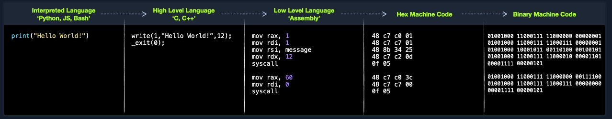
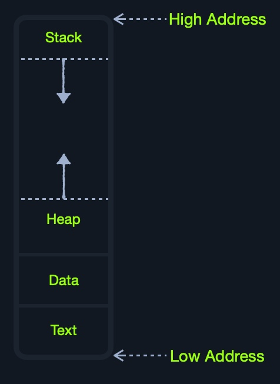
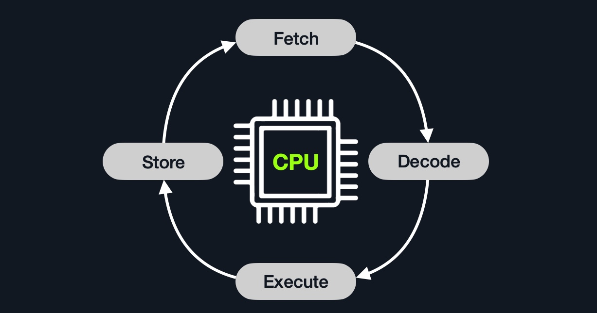
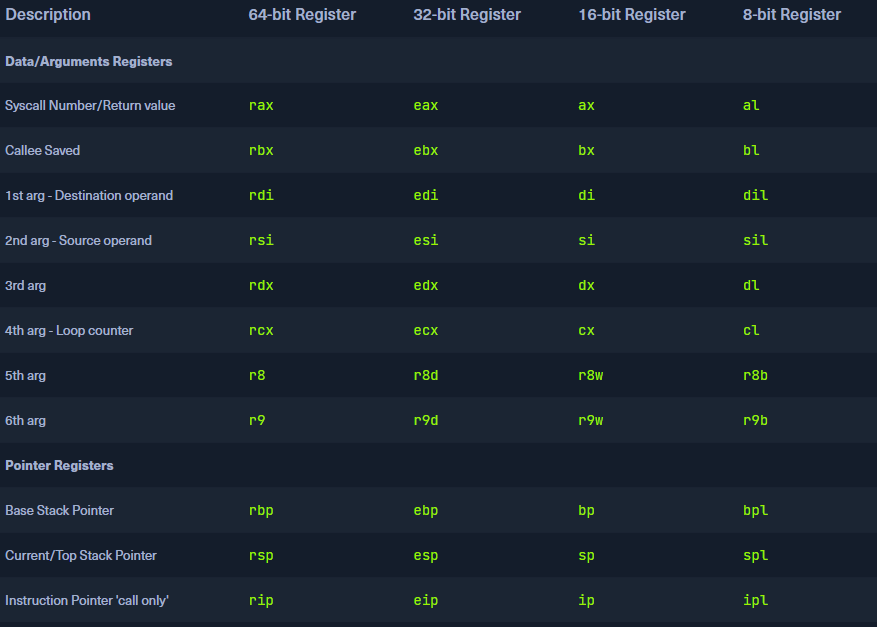
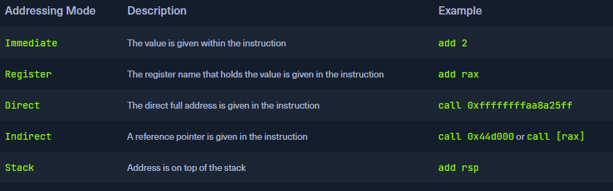
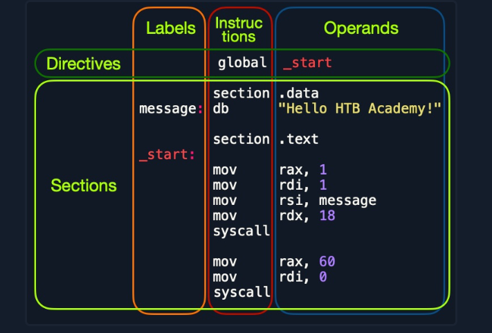

# Intro to assembly language
## Language

**assembler**: add rax, 1 == **shellcode**: 4883C001

**shellcode** is a hex representation fo **machine code**.



## Types of assembly
* intel x86_64
* ARM
    * M1
    * Mobile

[Von Neumann Architechture](https://en.wikipedia.org/wiki/Von_Neumann_architecture)


* Central Processing Unit
    * Control Unit
    * Arithmic/Logic Unit

* Memory
    * cache level 1-3 (fast)
    * Random Access Memory (slower)

## Cache
Located within the CPU itself, which in computer terms is lightyears closer than the RAM

* **level 1** kilobyte size fastest cache (slower than registers) per core 
* **level 2** megabytes shared between cores
* **level 3** megabytes (larger than l2), not all cpus have l3 

## RAM
Much larger than cache and much slower.

**Comparison**
| Memory Type | Cycles to Read |
| ----------- | ----------- |
| Registry | 1 |
| Cache | a few |
| RAM  | around 200 |


### Structure 

* **Stack** Last-in First-Out data can only be accessed with push and pop
* **Heap** data can be stored and read in any order. But is slower than stack
* **Data** data and .bss which respectivly is assinged variables and unassigned variables (buffers)
* **Text** Assembly instructions for the CPU to read

This segmentation is true for the entire systems RAM however each program/application is given its own VRAM so each application/program has its own stack, heap, data and text.

## I/O
The Input/Output include: keyboard, screen, long term storage units (hdd,ssd).

The processor access these devices using the **Bus Interface** which is a highway for data and addresses.

Accessing a long term storage unit is slower than accessing RAM. However unlike main memory this kind of storage isnt volatile like RAM, cache and registers. The benefit of long term storage is that RAM, cache and registers that after a reboot, the data on long term storage units persists while RAM etc. is wiped.

## CPU architecture

**RISC:**
Many simple instructions with more cycles yet cycles are faster and less power consuming

**CISC:**
Complex instruction with less and slower cycles and more power consumption

### Clock speed and cycle
Speed is denoted in Hertz today typically GHz which is to say how many ***billion*** cycles a second a processor performs. 4.3 GHz = 4.300.000.000 cycles a second. THATS A LOT!

Note that modern cpu's also have multiple cores running in paralel, so a 4 core at 4.3 GHz is effectively running 17,2 billion cycles a second.

### Instruction Cycle
An instruction Cycle is the cycle it takes for the cpu to process a single machine instruction



* **Fetch** IAR (Instruction Address Register)
* **Decode** Instructions from binary 
* **Execute** Fetch instruction operands from register/memory and process 
* **Store** new value in destination operand

***Note:*** All of the stages in the instruction cycle are carried out by the Control Unit, except when arithmetic instructions need to be executed "add, sub, ..etc", which are executed by the ALU.

Each Instruction Cycle takes multiple clock cycles to finish. The amount of clock cycles it takes varies from instruction and CPU architecture. 

**Example:**
If we were to execute the assembly instruction 
`add rax, 1`
, it would run through an instruction cycle:

Fetch the instruction from the rip register, 48 83 C0 01 (in binary).
Decode '48 83 C0 01' to know it needs to perform an add of 1 to the value at rax.
Get the current value at rax (by CU), add 1 to it (by the ALU).
Store the new value back to rax.

## Processor Specific
As touched upon previously there are two main ISA's:
**Complex Instrution Set Computer (CISC)** used in Intel and AMD CPU's 

**Reduced Instruction Set Computer (RISC)** ARM and Apple CPU's

### CISC
Increases the complexity of instructions to lower the overall amount of instruction cycles running on the CPU. 

### RISC
simple instructions which can be executed in one clock cycle. 
Supports about 200 instructions as opposed to CISC 1500'ish.

It is said that you can build a general-purpose computer which only supports one instruction.

### CISC vs RISC
| Aea | CISC | RISC |
| ----------- | ----------- | ----------- |
| Complexity | Favors complex instructions | Favors simple instructions |
| Length of instructions | Longer instructions | Shorter instructions |
| Total instructions per program | fewer instruction ie. shorter code | more instructions longer code |
| Optimization | Relies on hardware optimization (in CPU) | Relies on software optimization (In Assembly) |
| Instruction Execution Time | Variable | Fixed - one clock cycle |
| Instructions supported by cpu | about 1500 | about 200 |
| Power Consumption | High | very low |

## Registers, Addresses and Data Types
### Registers

There are two types of registers *data registers* and *pointer registers*
these are the ones I will focus on.
| Data Registers | Pointer Registers |
| ----------- | ----------- | 
| rax | rbp |
| rbx | rsp |
| rcx | rip |
| rdx | | 
| r8 | |
| r9 | |
| r10 | |

* Data Registers - are usually used for storing instructions/syscall arguments. The primary data registers are: rax, rbx, rcx, and rdx. The rdi and rsi registers also exist and are usually used for the instruction destination and source operands. Then, we have secondary data registers that can be used when all previous registers are in use, which are r8, r9, and r10.

* Pointer Registers - are used to store specific important address pointers. The main pointer registers are the Base Stack Pointer rbp, which points to the beginning of the Stack, the Current Stack Pointer rsp, which points to the current location within the Stack (top of the Stack), and the Register Instruction Pointer (rip), which holds the address of the next instruction.

### Sub-Registers
Each 64-bit register can be divided into smaller sub-registers




The use and purpose of these registers will be explored further down.

### Memory Adresses
x86_64-bit processors have (as the name suggests) 64-bit wide address range from 0x0 to 0xffffffffffffffff (16xf's). 

There are several ways to fetch adresses


remember lower is slower.

### Address Endianness
An address Endian is the order of which the bytes are stored or retrieved from memory.

### Little-Endian
Here the little or ending byte is filled/retrieved first. **right to left**


### Big-Endian
Here its the big or starting byte that is filled/retrieved first. **left to right**

**example**

`0x0011223344556677` is the address we would like to store in memory.

with **little-endian** we would first store 0x00 and then 0x11 -> 0x1100 -> 0x221100 -> 0x33221100 -> 0x4433221100 -> 0x554433221100 -> 0x66554433221100 -> 0x7766554433221100. So basically the value is stored in reverse.

if we wanna store a binary interger like 426 = 0000001 10101010 it would be stored in reverse 10101010 00000001 which could read as 43521 if not retrieved with little endian in mind. 

**little-Endian** is used with Intel/AMD x86 so I will default to this one if I don't specify something else.

### Data Types 

| Component | Length | Example | 
| ---------- | -------- | -------- |
| byte | 8 bits | 0xab | 
| word | 16 bits (2 bytes) | 0xabcd |
| double word (dword) | 32 bits - (4 bytes)| 0xabcdef12 | 
|quad word (qword) | 64 bits - 8 bytes | 0xabcdef1234567890 |

## Assembly File Structure
htbex1.asm
```
global  _start

section .data
    message: db "Hello HTB Academy!", 0x0a
    len equ $ - message

section .text
_start:
    mov     rax, 1
    mov     rdi, 1
    mov     rsi, message
    mov     rdx, len
    syscall
    
    mov     rax, 60
    mov     rdi, 0
    syscall
```



Essentially each line is made up of upto three elements

1. Labels
2. Instructions
3. Operands

As can be seen in the htbex1.asm file there is three main parts:
| Section | Description |
| -------- | -----------|
| global _start | This is a directive that directs the code to start eecuting at the _start label defined below |
| section .data | this is the data section, which should contain all of the variables. | 
| section .text | this is the text section containing all of the code to be executed. |
### Directives
Assembly code is line-based and will execute line by line. 
global _start tells assembler to jump to the label _start and start executing from the label and down.

### Variables
This is the **.data** section. Once the program is run all varialbes defined will be loaded into memory and be accessible for the program. This is part of the preprocess and is such happens before the program starts executing at **_start**

 | Instruction | Description |
| -------- | -----------|
| db 0x0a | Defines the byte 0x0a, which is a new line. |
| message db 0x41, 0x42, 0x43, 0x0a | Defines the label message => abc\n. |
| message db "Hello World!", 0x0a | Defines the label message => Hello World!\n | 

Using `len equ $-message` declares a variable len which is equal to the length of the variable message.

### Code
the **.text** section holds all of the assembly instructions nad loads them into the memory segment. When all instructions are loaded the execution can begin. 

One the **.text** segment is loaded into memory it is *read-only* where the **.data** is read/write. This distinction is part of memory protection to mitigate buffer overflows among other binary exploitations. 

## Assembling & Disassembling
Using the `nasm` tool we can compile our code and the use the tool `ld` to link the compiled code with OS features and libraries. 

Note: that using the file extensions .s or .asm are common practise.

`nasm -f elf64 helloworld.s`

Note: since we are using the 64 bit register names we also have to compile to 64 bit.
Compiling to 32 is done with `-f elf`

This is output a **helloworld.o** file which can be linked with **ld**.

`ld -o helloWorld helloworld.o`

Note: 32 bit would require the flag `-m elf_i386`

now there should be an executable helloWorld program which can be executed wiht `./helloWorld`

### Disassembling 

`objdump -M intel -d <binary>`

```
objdump -M intel -d helloWorld

helloWorld:     file format elf64-x86-64

Disassembly of section .text:

0000000000401000 <_start>:
  401000:	b8 01 00 00 00       	mov    eax,0x1
  401005:	bf 01 00 00 00       	mov    edi,0x1
  40100a:	48 be 00 20 40 00 00 	movabs rsi,0x402000
  401011:	00 00 00
  401014:	ba 12 00 00 00       	mov    edx,0x12
  401019:	0f 05                	syscall
  40101b:	b8 3c 00 00 00       	mov    eax,0x3c
  401020:	bf 00 00 00 00       	mov    edi,0x0
  401025:	0f 05                	syscall
  ```

Note that nasm changed many of the 64 bit registers to 32 bit registers where possible to use less memory. 

the flags: `--no-show-raw-insn --no-addresses` 
can be used to remove machine code and address leaving you with only assembly instructions.

`-sj .data` can be used to read the .data section

## GNU Debugger (GDB)
Alternatives to GDB include Radare, Hopper, Immunity Debugger and WinGDB.

A great plugin for GDB is [GEF](https://github.com/hugsy/gef)
GEF is build with reverse engineering and binary exploitation in mind.

| call | purpose | 
| -----| ------- |
| info | shows available info calls |
| info function | prints functions (_start) |
| info variables | prints variables |
| disas <func> | disassemble the function |

### Debugging with GDB

| Step | Description | 
| -----| ------- |
| Break | POI in the code |
| Examine | Running the program at examining its state at break points |
| Step  | Moving through the program one instruction at a time |
| Modify  | change register or address values to see how it affects the program |

#### Break
Breakpoints are essential in debugging they usually are placed before logical forks in the code to inspect the programs state, so the programmer can determine why the program is misbahaving.

b or break can be used in GDB 

`b _start` will set a breakpoint at the _start label.

use r or run to run the program in GDB

If we want to set a breakpoint at a certain address, like _start+10, we can either b *_start+10 or b *0x40100a (note that start is at 0x401000 a is hexadecimal for 10)

use c or continue to continue or to next break point or program termination. 

use r or run to restart.

If we want to see what breakpoints we have at any point of the execution, we can use the info breakpoint command. We can also disable, enable, or delete any breakpoint. Furthermore, GDB also supports setting conditional breaks that stop the execution when a specific condition is met.

#### Examine

to examine we can use the x command (help x)

´x/FMT ADDRESS´

FMT is short for format and can have three parts: count, format, size

* **Count** can be any non negative integer which represent how many times we would like to repeat the examine
* **Format** x(hex) s(string) or i(instruction)
* **Size** b(byte) h(halfword) w(word)g(giant 8bytes)

example reading the next four instruction of the code can be done with x/4ig $rip
which reads 4 instructions of size giant from the rip registry (instruction pointer).

**Strings**
`x/s 0x402000` can be used to read the string stored at that memory address

**Addresses**
`x/wx 0x401000`prints the value stored at address 0x401000 in hexadecimal. Since we have instructions stored there it could be prudent to print with "i" to get the instruction rather than its hexadecimal notation.

using GEF we can print the value of all registers with the call `registers` simple right?

**Step**

stepping is progressing the code one step as if there was a break point right after the current break point. This can really help getting an overview at how the machine actually handles the code that was parsed to it. 

**Step Instruction**
``stepi` or `si` will ask the debugger to step forward.

**Step count**
you can add an integer to step forward a given amount of steps like 5: `si 5`

#### Modify
This lets us modify values at certain points in the execution to see the impact it has on the program.

in GDP there is the `set` command to do this. But the `patch` command from GEF is considered easier to use.

# Module Project
By the end of this module we will have developed a program that prints the fibonacci chain of numbers

## Data Movemment
* `mov` move data or load immidiate data
* `lea` Load an address pointing to a value
* `xchg` Swap data between two registers or addresses

Not that `mov` intuitively works more like a copy since moving data from one register to the other doesnt remove it from the sending register, where the data is moved from. So its better to think of it as copy.

As we know, when asm code is translated into binary some changes in the name of optimization can happen. However it can be more effiecient to do those optimizations yourself. 

For example when moving 0 and 1 into a 64-bit register the nasm compiler will turn that code into 32-bit registers. However 32-bit is still way to much space to store that little data. Using the 1-byte registers al and bl is more effiecient.

## Address Pointers 
Some times data is not immidiatly present in a register, instead an address pointer is present in the register telling you where the data you want is located. This is always the case with **rsp**, **rbp** and **rip**.

### Moving Pointer Values
Consider the following line from gsb
`$rsp   : 0x00007fffffffdc30  →  0x0000000000000001`
This line indicates that **rsp** has the value of `0x00007fffffffdc30`which is an address pointing to the actual value of `0x0000000000000001` say we move rsp into rax. What value does rax have then? 

`0x00007fffffffe490`! If we want the value that **rsp** points to, we will have to tell assembler that it needs to resolve the address in **rsp** and read that value.

This is done by using **[ ]** in x86_64 and Intel syntax this mean load value at address. So to get the value at address **rsp** into rav we would type `mov rax, [rsp]`

This is shown in code/rsp.asm

Note that nasm help with the pointer resolution `mov    rax, QWORD PTR [rsp]`

### Loading Value Pointers 
´lea rax, [rsp]´ is kinda the opposite of what we just learned.
Sometimes we need to load the address of a value into a register rather than the actual value. 

`lea` trully comes into its own when used with offsets like `[rsp+10]`

### Arithmetic Instructions

The arithemetic instructions are typically processed by the ALU on the CPU. There are two types of Arithmetic Instructions:
* Unary
* Binary
#### Unary
types of **unary** instructions:
inc & dec. As the names suggest these operations increment or decrement the argument

#### Binary
add, sub(tract) and imul (multiply), are binary operations since they need two operands. The operands can (ofcourse) be the same like `add rax, rax` 

**Note**: the computed value is always moved to the first operand in the above example **rax**

#### Bitwise Instructions
These operations work on a binary level 
* not -> inverts all bits 
* and 
* or 
* xor -> good for resetting -> xor rax,rax -> 0x00


## Loops

