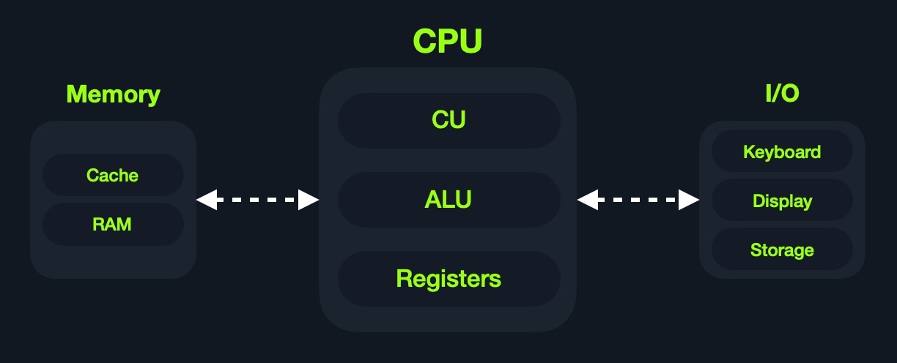

# Intro to assembly language
## Language

**assembler**: add rax, 1 == **shellcode**: 4883C001

**shellcode** is a hex representation of **machine code**.


## Types of assembly
* intel x86_64
* ARM
    * M1
    * Mobile

[Von Neumann Architechture](https://en.wikipedia.org/wiki/Von_Neumann_architecture)



* Central Processing Unit
    * Control Unit
    * Arithmic/Logic Unit

* Memory
    * cache level 1-3 (fast)
    * Random Access Memory (slower)

## Cache
Located within the CPU itself, which in computer terms is lightyears closer than the RAM

* **level 1** kilobyte size fastest cache (slower than registers) per core 
* **level 2** megabytes shared between cores
* **level 3** megabytes (larger than l2), not all cpus have l3 

## RAM
Much larger than cache and much slower.

**Comparison**
| Memory Type | Cycles to Read |
| ----------- | ----------- |
| Registry | 1 |
| Cache | a few |
| RAM  | around 200 |


### Structure 

* **Stack** Last-in First-Out data can only be accessed with push and pop
* **Heap** data can be stored and read in any order. But is slower than stack
* **Data** data and .bss which respectivly is assinged variables and unassigned variables (buffers)
* **Text** Assembly instructions for the CPU to read

This segmentation is true for the entire systems RAM however each program/application is given its own VRAM so each application/program has its own stack, heap, data and text.

## I/O
The Input/Output include: keyboard, screen, long term storage units (hdd,ssd).

The processor access these devices using the **Bus Interface** which is a highway for data and addresses.

Accessing a long term storage unit is slower than accessing RAM. However unlike main memory this kind of storage isnt volatile like RAM, cache and registers. The benefit of long term storage is that RAM, cache and registers that after a reboot, the data on long term storage units persists while RAM etc. is wiped.

## CPU architecture

**RISC:**
Many simple instructions with more cycles yet cycles are faster and less power consuming

**CISC:**
Complex instruction with less and slower cycles and more power consumption

### Clock speed and cycle
Speed is denoted in Hertz today typically GHz which is to say how many ***billion*** cycles a second a processor performs. 4.3 GHz = 4.300.000.000 cycles a second. THATS A LOT!

Note that modern cpu's also have multiple cores running in paralel, so a 4 core at 4.3 GHz is effectively running 17,2 billion cycles a second.

### Instruction Cycle
An instruction Cycle is the cycle it takes for the cpu to process a single machine instruction


* **Fetch** IAR (Instruction Address Register)
* **Decode** Instructions from binary 
* **Execute** Fetch instruction operands from register/memory and process 
* **Store** new value in destination operand

***Note:*** All of the stages in the instruction cycle are carried out by the Control Unit, except when arithmetic instructions need to be executed "add, sub, ..etc", which are executed by the ALU.

Each Instruction Cycle takes multiple clock cycles to finish. The amount of clock cycles it takes varies from instruction and CPU architecture. 

**Example:**
If we were to execute the assembly instruction 
`add rax, 1`
, it would run through an instruction cycle:

Fetch the instruction from the rip register, 48 83 C0 01 (in binary).
Decode '48 83 C0 01' to know it needs to perform an add of 1 to the value at rax.
Get the current value at rax (by CU), add 1 to it (by the ALU).
Store the new value back to rax.

## Processor Specific
As touched upon previously there are two main ISA's:
**Complex Instrution Set Computer (CISC)** used in Intel and AMD CPU's 

**Reduced Instruction Set Computer (RISC)** ARM and Apple CPU's

### CISC
Increases the complexity of instructions to lower the overall amount of instruction cycles running on the CPU. 

### RISC
simple instructions which can be executed in one clock cycle. 
Supports about 200 instructions as opposed to CISC 1500'ish.

It is said that you can build a general-purpose computer which only supports one instruction.

### CISC vs RISC
| Aea | CISC | RISC |
| ----------- | ----------- | ----------- |
| Complexity | Favors complex instructions | Favors simple instructions |
| Length of instructions | Longer instructions | Shorter instructions |
| Total instructions per program | fewer instruction ie. shorter code | more instructions longer code |
| Optimization | Relies on hardware optimization (in CPU) | Relies on software optimization (In Assembly) |
| Instruction Execution Time | Variable | Fixed - one clock cycle |
| Instructions supported by cpu | about 1500 | about 200 |
| Power Consumption | High | very low |

## Registers, Addresses and Data Types
### Registers

There are two types of registers *data registers* and *pointer registers*
these are the ones I will focus on.
| Data Registers | Pointer Registers |
| ----------- | ----------- | 
| rax | rbp |
| rbx | rsp |
| rcx | rip |
| rdx | | 
| r8 | |
| r9 | |
| r10 | |

* Data Registers - are usually used for storing instructions/syscall arguments. The primary data registers are: rax, rbx, rcx, and rdx. The rdi and rsi registers also exist and are usually used for the instruction destination and source operands. Then, we have secondary data registers that can be used when all previous registers are in use, which are r8, r9, and r10.

* Pointer Registers - are used to store specific important address pointers. The main pointer registers are the Base Stack Pointer rbp, which points to the beginning of the Stack, the Current Stack Pointer rsp, which points to the current location within the Stack (top of the Stack), and the Register Instruction Pointer (rip), which holds the address of the next instruction.

### Sub-Registers
Each 64-bit register can be divided into smaller sub-registers


The use and purpose of these registers will be explored further down.

### Memory Adresses
x86_64-bit processors have (as the name suggests) 64-bit wide address range from 0x0 to 0xffffffffffffffff (16xf's). 

There are several ways to fetch adresses


remember lower is slower.

### Address Endianness
An address Endian is the order of which the bytes are stored or retrieved from memory.

### Little-Endian
Here the little or ending byte is filled/retrieved first. **right to left**


### Big-Endian
Here its the big or starting byte that is filled/retrieved first. **left to right**

**example**

`0x0011223344556677` is the address we would like to store in memory.

with **little-endian** we would first store 0x00 and then 0x11 -> 0x1100 -> 0x221100 -> 0x33221100 -> 0x4433221100 -> 0x554433221100 -> 0x66554433221100 -> 0x7766554433221100. So basically the value is stored in reverse.

if we wanna store a binary interger like 426 = 0000001 10101010 it would be stored in reverse 10101010 00000001 which could read as 43521 if not retrieved with little endian in mind. 

**little-Endian** is used with Intel/AMD x86 so I will default to this one if I don't specify something else.

### Data Types 

| Component | Length | Example | 
| ---------- | -------- | -------- |
| byte | 8 bits | 0xab | 
| word | 16 bits (2 bytes) | 0xabcd |
| double word (dword) | 32 bits - (4 bytes)| 0xabcdef12 | 
|quad word (qword) | 64 bits - 8 bytes | 0xabcdef1234567890 |

## Assembly File Structure
htbex1.asm
```
global  _start

section .data
    message: db "Hello HTB Academy!", 0x0a
    len equ $ - message

section .text
_start:
    mov     rax, 1
    mov     rdi, 1
    mov     rsi, message
    mov     rdx, len
    syscall
    
    mov     rax, 60
    mov     rdi, 0
    syscall
```


Essentially each line is made up of upto three elements

1. Labels
2. Instructions
3. Operands

As can be seen in the htbex1.asm file there is three main parts:
| Section | Description |
| -------- | -----------|
| global _start | This is a directive that directs the code to start eecuting at the _start label defined below |
| section .data | this is the data section, which should contain all of the variables. | 
| section .text | this is the text section containing all of the code to be executed. |
### Directives
Assembly code is line-based and will execute line by line. 
global _start tells assembler to jump to the label _start and start executing from the label and down.

### Variables
This is the **.data** section. Once the program is run all varialbes defined will be loaded into memory and be accessible for the program. This is part of the preprocess and is such happens before the program starts executing at **_start**

 | Instruction | Description |
| -------- | -----------|
| db 0x0a | Defines the byte 0x0a, which is a new line. |
| message db 0x41, 0x42, 0x43, 0x0a | Defines the label message => abc\n. |
| message db "Hello World!", 0x0a | Defines the label message => Hello World!\n | 

Using `len equ $-message` declares a variable len which is equal to the length of the variable message.

### Code
the **.text** section holds all of the assembly instructions nad loads them into the memory segment. When all instructions are loaded the execution can begin. 

One the **.text** segment is loaded into memory it is *read-only* where the **.data** is read/write. This distinction is part of memory protection to mitigate buffer overflows among other binary exploitations. 

## Assembling & Disassembling
Using the `nasm` tool we can compile our code and the use the tool `ld` to link the compiled code with OS features and libraries. 

Note: that using the file extensions .s or .asm are common practise.

`nasm -f elf64 helloworld.s`

Note: since we are using the 64 bit register names we also have to compile to 64 bit.
Compiling to 32 is done with `-f elf`

This is output a **helloworld.o** file which can be linked with **ld**.

`ld -o helloWorld helloworld.o`

Note: 32 bit would require the flag `-m elf_i386`

now there should be an executable helloWorld program which can be executed wiht `./helloWorld`

### Disassembling 

`objdump -M intel -d <binary>`

```
objdump -M intel -d helloWorld

helloWorld:     file format elf64-x86-64

Disassembly of section .text:

0000000000401000 <_start>:
  401000:	b8 01 00 00 00       	mov    eax,0x1
  401005:	bf 01 00 00 00       	mov    edi,0x1
  40100a:	48 be 00 20 40 00 00 	movabs rsi,0x402000
  401011:	00 00 00
  401014:	ba 12 00 00 00       	mov    edx,0x12
  401019:	0f 05                	syscall
  40101b:	b8 3c 00 00 00       	mov    eax,0x3c
  401020:	bf 00 00 00 00       	mov    edi,0x0
  401025:	0f 05                	syscall
  ```

Note that nasm changed many of the 64 bit registers to 32 bit registers where possible to use less memory. 

the flags: `--no-show-raw-insn --no-addresses` 
can be used to remove machine code and address leaving you with only assembly instructions.

`-sj .data` can be used to read the .data section

## GNU Debugger (GDB)
Alternatives to GDB include Radare, Hopper, Immunity Debugger and WinGDB.

A great plugin for GDB is [GEF](https://github.com/hugsy/gef)
GEF is build with reverse engineering and binary exploitation in mind.

| call | purpose | 
| -----| ------- |
| info | shows available info calls |
| info function | prints functions (_start) |
| info variables | prints variables |
| disas <func> | disassemble the function |

### Debugging with GDB

| Step | Description | 
| -----| ------- |
| Break | POI in the code |
| Examine | Running the program at examining its state at break points |
| Step  | Moving through the program one instruction at a time |
| Modify  | change register or address values to see how it affects the program |

#### Break
Breakpoints are essential in debugging they usually are placed before logical forks in the code to inspect the programs state, so the programmer can determine why the program is misbahaving.

b or break can be used in GDB 

`b _start` will set a breakpoint at the _start label.

use r or run to run the program in GDB

If we want to set a breakpoint at a certain address, like _start+10, we can either b *_start+10 or b *0x40100a (note that start is at 0x401000 a is hexadecimal for 10)

use c or continue to continue or to next break point or program termination. 

use r or run to restart.

If we want to see what breakpoints we have at any point of the execution, we can use the info breakpoint command. We can also disable, enable, or delete any breakpoint. Furthermore, GDB also supports setting conditional breaks that stop the execution when a specific condition is met.

#### Examine

to examine we can use the x command (help x)

´x/FMT ADDRESS´

FMT is short for format and can have three parts: count, format, size

* **Count** can be any non negative integer which represent how many times we would like to repeat the examine
* **Format** x(hex) s(string) or i(instruction)
* **Size** b(byte) h(halfword) w(word)g(giant 8bytes)

example reading the next four instruction of the code can be done with x/4ig $rip
which reads 4 instructions of size giant from the rip registry (instruction pointer).

**Strings**
`x/s 0x402000` can be used to read the string stored at that memory address

**Addresses**
`x/wx 0x401000`prints the value stored at address 0x401000 in hexadecimal. Since we have instructions stored there it could be prudent to print with "i" to get the instruction rather than its hexadecimal notation.

using GEF we can print the value of all registers with the call `registers` simple right?

**Step**

stepping is progressing the code one step as if there was a break point right after the current break point. This can really help getting an overview at how the machine actually handles the code that was parsed to it. 

**Step Instruction**
``stepi` or `si` will ask the debugger to step forward.

**Step count**
you can add an integer to step forward a given amount of steps like 5: `si 5`

#### Modify
This lets us modify values at certain points in the execution to see the impact it has on the program.

in GDP there is the `set` command to do this. But the `patch` command from GEF is considered easier to use.

# Module Project
By the end of this module we will have developed a program that prints the fibonacci chain of numbers

## Data Movemment
* `mov` move data or load immidiate data
* `lea` Load an address pointing to a value
* `xchg` Swap data between two registers or addresses

Not that `mov` intuitively works more like a copy since moving data from one register to the other doesnt remove it from the sending register, where the data is moved from. So its better to think of it as copy.

As we know, when asm code is translated into binary some changes in the name of optimization can happen. However it can be more effiecient to do those optimizations yourself. 

For example when moving 0 and 1 into a 64-bit register the nasm compiler will turn that code into 32-bit registers. However 32-bit is still way to much space to store that little data. Using the 1-byte registers al and bl is more effiecient.

## Address Pointers 
Some times data is not immidiatly present in a register, instead an address pointer is present in the register telling you where the data you want is located. This is always the case with **rsp**, **rbp** and **rip**.

### Moving Pointer Values
Consider the following line from gsb
`$rsp   : 0x00007fffffffdc30  →  0x0000000000000001`
This line indicates that **rsp** has the value of `0x00007fffffffdc30`which is an address pointing to the actual value of `0x0000000000000001` say we move rsp into rax. What value does rax have then? 

`0x00007fffffffe490`! If we want the value that **rsp** points to, we will have to tell assembler that it needs to resolve the address in **rsp** and read that value.

This is done by using **[ ]** in x86_64 and Intel syntax this mean load value at address. So to get the value at address **rsp** into rav we would type `mov rax, [rsp]`

This is shown in code/rsp.asm

Note that nasm help with the pointer resolution `mov    rax, QWORD PTR [rsp]`

### Loading Value Pointers 
´lea rax, [rsp]´ is kinda the opposite of what we just learned.
Sometimes we need to load the address of a value into a register rather than the actual value. 

`lea` trully comes into its own when used with offsets like `[rsp+10]`

### Arithmetic Instructions

The arithemetic instructions are typically processed by the ALU on the CPU. There are two types of Arithmetic Instructions:
* Unary
* Binary
#### Unary
types of **unary** instructions:
inc & dec. As the names suggest these operations increment or decrement the argument

#### Binary
add, sub(tract) and imul (multiply), are binary operations since they need two operands. The operands can (ofcourse) be the same like `add rax, rax` 

**Note**: the computed value is always moved to the first operand in the above example **rax**

#### Bitwise Instructions
These operations work on a binary level 
* not -> inverts all bits 
* and 
* or 
* xor -> good for resetting -> xor rax,rax -> 0x00


## Loops

In this part we further examining **Control Instructions** including
* Loops
* Branching 
* Function Calls

### Loop Structure
**loop.asm**
```
exampleLoop:
    instruction 1
    instruction 2
    instruction 3
    instruction 4
    instruction 5
    loop exampleLoop
```
When using the **loop** instruction you have to move the number of desired iterartions into the **rcx** register, because everytime the **loop** instruction is seen it implicitly runs the instruction ``dec rcx`` and if rcx is not zero it jumps to the label in the instruction.

```
global  _start

section .text
_start:
    xor rax, rax        ; xor with itself to clear all data to 0x00
    xor rbx, rbx        ; ------||------
    inc rbx             ; incrementing register rbx (64-bit)
    mov rcx, 10         ; moving 10 into rcx (the loop register)
loopFib:
    add rax, rbx        ; add rax and rbx storing the result in rax
    xchg rax, rbx       ; swap values in the provided registers
    loop loopFib        ; while rcx != 0 jmp to loopFib
```

### Unconditional Branching

Another type of **Control Instruction** is **Branching Instructions**. These types of instructions allow the program to **jump** to any point in the code, if a specific condition is met. 

#### JMP
the **jmp** instruction jumps the program to the label specified. `jmp jumpLabel`

for looping purposes we can adapt the loopFib.asm 

```
global  _start

section .text
_start:
    xor rax, rax    ; initialize rax to 0
    xor rbx, rbx    ; initialize rbx to 0
    inc rbx         ; increment rbx to 1
    mov rcx, 10
loopFib:
    add rax, rbx    ; get the next number
    xchg rax, rbx   ; swap values
    jmp loopFib
```
Notice a problem? since jmp is unconditional this program will not terminate by itself but will keep finding bigger and bigger fibonacci numbers until manually terminated.
This is because there is no exit condition. 

### Conditional Branching
Conditional Branching is jump statements, that only jumps to the label if a condition is met. There are many of these statement below is a table of the most used once:


| Instruction | Condition | Description |
| ----------- | --------- | ----------- | 
| jz | D = 0 | Destination equal to Zero |  
| jnz | D != 0 | Destination Not equal to Zero |  
| js | D < 0 | Destination is Negative |
| jns | D >= 0 | Destination is Not Negative |
| jg | D > S | Destination Greater than Source |
| jge | D >= 0 | Destination Greather than or Equal to Source |
| jl | D < S | Destination Less than Source |
| jle | D =< S | Destination Less or equal to Source |  

Conditional instructions are not exclusive to the jmp instruction. 

For example, if we wanted to perform a mov rax, rbx instruction, but only if the condition is = 0, then we can use the CMOVcc or conditional mov instruction, such as cmovz rax, rbx instruction. Similarly, if we wanted to move if the condition is <, then we can use the cmovl rax, rbx instruction, and so on for other conditions. The same applies to the set instruction, which sets the operand's byte to 1 if the condition is met or 0 otherwise. An example of this is setz rax.

#### RFLAGS Register
The RFLAGS register is a 64-bit register but unlike other registers it does not hold values but "flag bits" instead.

if a dec instruction results in a 0 then bit **#6** the Zero Flag ZF turns to 1 (meaning True).

When a devision operations results in a float the Carry Flag **CF** will be 1, similarily if the sub instruction yield a negative number the Sign Flag SF will turn on.

There are many flags but for this text we will be most interested in these:
* The Carry Flag CF: Indicates whether we have a float.
* The Parity Flag PF: Indicates whether a number is odd or even.
* The Zero Flag ZF: Indicates whether a number is zero
* The Sign Flag SF: Indicates whether a register is negative.

As previousl mentioned the **loop** operation is two operations in one `dec rcx` `jnz loopFip`.

```
global  _start

section .text
_start:
    xor rax, rax    ; initialize rax to 0
    xor rbx, rbx    ; initialize rbx to 0
    inc rbx         ; increment rbx to 1
    mov rcx, 10
loopFib:
    add rax, rbx    ; get the next number
    xchg rax, rbx   ; swap values
    dec rcx			; decrement rcx counter
    jnz loopFib		; jump to loopFib until rcx is 0
    
```

GEF will capitalize the bit that is on:

`$eflags: [ZERO carry PARITY adjust sign trap INTERRUPT direction overflow RESUME virtualx86 identification]`

#### CMP

| Instruction |	Description | Example |
| ----------| ------------- |--------|
| cmp | Sets RFLAGS by subtracting second operand from first operand (i.e. first - second) | cmp rax, rbx -> rax - rbx |

using `cmp rbx, 10 -> rbx - 10` the result will not be stored anywhere but will affect the flags like negative if rbx < 10 will be turned on (NEGATIVE).

This means we can use the **js** to jump to a looping label.

```
global  _start

section .text
_start:
    xor rax, rax    ; initialize rax to 0
    xor rbx, rbx    ; initialize rbx to 0
    inc rbx         ; increment rbx to 1
loopFib:
    add rax, rbx    ; get the next number
    xchg rax, rbx   ; swap values
    cmp rbx, 10		; do rbx - 10
    js loopFib		; jump if result is <0
```

## Using the Stack

The Stack is a segment of memory allocated for the program to store data in.

The top of the stack is pointed at by the **rsp** register. 

data can be pushed and poped to the stack

| Instruction | Description | Example |
| ----------- | ----------- | ------- |
| push |	Copies the specified register/address to the top of the stack |	push rax |
| pop | Moves the item at the top of the stack to the specified register/address |	pop rax |

The **Stack** is a Last-in First-out structure. Like with **mov** when we **push** to the stack the data is copied from the register, meaning the register retains its value after the push instructions has executed. *However* it is important to remember that pop will remove the first block of data on the stack, so as to make way for the next element on the stack.

Note that Syscalls make use of registers and might overwrite what you have stored in them. A good practise is to push registers to the stack before a syscall, to avoid problems.

## Syscalls
A **syscall** is like a globally available function written in C, provided by the system kernel. 

On linux all syscalls are defined in the **unistd_64.h**

`cat /usr/include/x86_64-linux-gnu/asm/unistd_64.h`

Note the 64 in the file name. The 32-bit equivalent file is called **unistd_32.h**

[Syscall Table](https://filippo.io/linux-syscall-table/)

### Syscall Arguments

| Description | 64-bit Register |
| ----------- | --------------- |
| Syscall Number / Return Value | rax |
| Callee Saved | rbx |
| 1st arg | rdi |
| 2nd arg | rsi |
| 3rd arg | rdx |
| 4th arg | rcx |
| 5th arg | r8 |
| 6th arg | r9 | 

Very few syscalls use more than 6 arguments, but those few that do use the stack to store the remaining arguments, so it's a good idea to keep an eye out of those. 

Lets keep it simple in here however. Using the write syscall we need to provide 3 things: Where to write usually this will be the value 1 meaning **stdout**, **pointer to the string to write**, **length of string (int)** Respectivly these values whould be moved to **rdi, rsi and rdx**

1. rdi -> 1
2. rsi -> 'Some String\n'
3. rdx -> 12

Given that strings are very big data stuctures they can be hard to contain in a registers so its usually better to pass a pointer to a string variable. 

'man -s 2 <syscall>' prints the manual entry for the syscall detailing the arguments to be passed to it.

## Procedures
As code grows in complexity the need for refactorization grows aswell. One way to simplify assembly code is to use procedures.

A procedure, sometimes called a subroutine, is a set of instructions which we expect to be used by the program multiple times, instead of writing the same lines of code multiple places we can write them in a procedure and call the procedure when we need it.

```
global  _start

section .data
    message db "Fibonacci Sequence:", 0x0a

section .text
_start:

printMessage:
    mov rax, 1       ; rax: syscall number 1
    mov rdi, 1      ; rdi: fd 1 for stdout
    mov rsi,message ; rsi: pointer to message
    mov rdx, 20      ; rdx: print length of 20 bytes
    syscall         ; call write syscall to the intro message

initFib:
    xor rax, rax    ; initialize rax to 0
    xor rbx, rbx    ; initialize rbx to 0
    inc rbx         ; increment rbx to 1

loopFib:
    add rax, rbx    ; get the next number
    xchg rax, rbx   ; swap values
    cmp rbx, 10		; do rbx - 10
    js loopFib		; jump if result is <0

Exit:
    mov rax, 60
    mov rdi, 0
    syscall
```

### CALL / RET

With the two instructions **call** and **ret** we cab nove the instruction pointer to the label we want and with ret we can move back to where we called from. 

```
global  _start

section .data
    message db "Fibonacci Sequence:", 0x0a

section .text
_start:
    call printMessage   ; print intro message
    call initFib        ; set initial Fib values
    call loopFib        ; calculate Fib numbers
    call Exit           ; Exit the program

printMessage:
    mov rax, 1      ; rax: syscall number 1
    mov rdi, 1      ; rdi: fd 1 for stdout
    mov rsi,message ; rsi: pointer to message
    mov rdx, 20     ; rdx: print length of 20 bytes
    syscall         ; call write syscall to the intro message
    ret

initFib:
    xor rax, rax    ; initialize rax to 0
    xor rbx, rbx    ; initialize rbx to 0
    inc rbx         ; increment rbx to 1
    ret

loopFib:
    add rax, rbx    ; get the next number
    xchg rax, rbx   ; swap values
    cmp rbx, 10		; do rbx - 10
    js loopFib		; jump if result is <0
    ret

Exit:
    mov rax, 60
    mov rdi, 0
    syscall
```

## Functions
Functions are similar to procedures with the key difference that we expect a function to make use of all registers, that means that we can't just call a function like with a procedure rather we have to use the **Calling Convention**

1. Save Registers on the stack(**Caller Saved**)
2. Pass Function Arguments
3. Fix Stack Alignment
4. Get Function's Return Value (In **rax**)

There is also the other side of the coin as there is also a **Function Convention**.

1. Saving Callee Saved registers rbx and rbp
2. Get arguments from the registers
3. Align the Stack
4. Return value in **rax**

### Using External Functions
the write syscall only takes ASCII characters and converting an integer to an ASCII character in assembly is beyond the scope. So we will use an external function from libc, which is the **printf**.

The way to use external functions in assembly is similiar to other programming languges you import it at the head of your source code:
```
global _start
extern printf

<assembly code...>
``` 

Notice in the below code how we pop in reverse of how we pushed. Remember that the stack is **LIFO**
```
printFib:
    push rax        ; rax to the top of the stack
    push rbx        ; rbx to the top of the stack
    ; function call
    pop rbx
    pob rax
```

#### Stack Alignment
The stack needs to be aligned when calling a function this is for cpu runtime optimization an is enforced by the C libaries. 

#### Function arguments 
Its time to consult the man!
`man -s 3 printf` `int printf(const char *restric format, ...);`

# Shell Codes
A shell code is, as we touched upon earlier, a hexadecimal representation of the binary executable.

The "Hello World" program from earlier would look like this in shellcode `48be0020400000000000bf01000000ba12000000b8010000000f05b83c000000bf000000000f05`

## Use in Pentesting
Having the ability to pass shellcode into the processors memory is essential in Binary Exploitation. We could for example pass a reverse shell to the processor.

Modern x86_64 systems have protection aganinst loading shellcode into memory. 

Another great use case of shellcode is when we can inject it directly into memory and not have to write anything to the disk making it that much harder to detect 

## Assembly to Machine Code 
translating assembly code to shell code manually is not worth the effort. Luckily there is a python tool pwntools

`sudo pip3 install pwntools`

```
$ pwn asm 'push rax' -c 'amd64'
50
```

```
bloechrr@htb[/htb]$ pwn disasm '50' -c 'amd64'
   0:    50                       push   rax
```

Using the shellcoder.py in the shell_code directory you can pass a binary file as arg 1 to have its shellcode printed.

if you have some shell code you would like to test before running it on metal use the loader.py script with the shellcode string as arg 1

Finally we can assembel and debug our code with the assembler.py script arg 1 is for shellcode and 2nd argument is for the name of the output binary which we can then debug with `gdb -q <binaryName>`

if you set at breakpoin at `*0x401000` you will break at the default binary entry point.

## Shell Coding Techniques
Not all binaries give working shellcodes which can be loaded directly into memory and run. 
If we look at the  shellcode from a Hello World program:

```
pwn disasm '48be0020400000000000bf01000000ba12000000b8010000000f05b83c000000bf000000000f05' -c 'amd64'
   0:    48 be 00 20 40 00 00 00 00 00    movabs rsi,  0x402000
   a:    bf 01 00 00 00           mov    edi,  0x1
   f:    ba 12 00 00 00           mov    edx,  0x12
  14:    b8 01 00 00 00           mov    eax,  0x1
  19:    0f 05                    syscall
  1b:    b8 3c 00 00 00           mov    eax,  0x3c
  20:    bf 00 00 00 00           mov    edi,  0x0
  25:    0f 05                    syscall
```

We can see that the instructions are similair to what we expect but not entirely indentical

We can see that our data file with "Hello World" is not in the disassembled code for example.

For Shell Code to be "compliant" it needs to adheer to the **Shellcoding Requirements**
1. Does not contain variables
2. Does not refer to direct memory addresses 
3. Does not contain any NULL bytes 00

Lets look at the hello world source code:

```
global _start

section .data
    message db "Hello HTB Academy!"

section .text
_start:
    mov rsi, message
    mov rdi, 1
    mov rdx, 18
    mov rax, 1
    syscall

    mov rax, 60
    mov rdi, 0
    syscall
```

### Remove Variables
Since variables are not alowed in shellcode we have to have all our operations happen inside the .text section of the code.

The two options we have is to either move the string into registers (which can contain 8 bytes), which only works for smaller strings

The other options is to push the string to the stack 16 bytes at a time to ensure alignment.

```
    push 'y!'
    push 'B Academ'
    push 'Hello HT'
    mov rsi, rsp
```
This would exceed the allowed bounds of immediate strings push which is 4 bytes at a time: 
```
    mov rbx, 'y!'
    push rbx
    mov rbx, 'B Academ'
    push rbx
    mov rbx, 'Hello HT'
    push rbx
    mov rsi, rsp
```

### Remove Addresse 
With the removal of the variable address we removed every address reference in the hello world code. 

To continue to adhere to shellcode compliance we need to avoid direct memory addresses, and stick to labels and relative memory addresses.

Throghout theses notes relative addresses and labal is all we have been using. 

These are the steps to fix having direct  memory addreses


1.  Replacing with calls to labels or rip-relative addresses (for calls and loops)
2.  Push to the Stack and use rsp as the address (for mov and other assembly instructions)

### Remove NULL 
NULL charactrers 0x00 are used as string terminators. looking back at the pwn disasm output we see alot of 00's this commonly happens when moving small integers into large registers, the way its handled is that the compiler "pads" the register with NULL bytes. 

`pwn asm 'mov rax, 1' -c 'amd64'`

to avoid this padding we can use the appropriate register size 

`mov al, 1`

before moving data into al remember to clear the 64-bit parent register for data.

```
$ pwn asm 'xor rax, rax' -c 'amd64'
4831c0
$ pwn asm 'mov al, 1' -c 'amd64'
b001
 ```
I have rewritten the htbex.asm to be shellcode compliant in > code/shell_comp_hello_world.asm 

compiling to shellcode gives `4831db66bb79215348bb422041636164656d5348bb48656c6c6f204854534889e64831c0b0014831ff40b7014831d2b2120f054831c0043c4030ff0f05`

## Shell Shellcode
There are many tools to help with crafting shellcode, but before we dig into those lets try and build our own.

We will be using syscall 59 execve which will allow us to execute a system application.

```
$man -s 2 execve

int execve(const char *pathname, char *const argv[], char *const envp[]);
```

As we can see the syscall takes three arguments
1. the path to the program to be executed
2. list of pointers to argmuents for the program
3. enviroment variables

So to execute this we will need:

* rax = 59 
* rdi = ['/bin//sh'] 
* rsi = ['/bin//sh']
* rdx = NULL

Note that there are two forward slashed ('/'). So there are now 8 characters, which fills up a 64-bit register. Now we dont have to worry about clearing the register for remaining data since we use all bits in it. 

```
global _start

section .text
_start:
    mov rax, 59         ; execve syscall number
    push 0              ; push NULL string terminator
    mov rdi, '/bin//sh' ; first arg to /bin/sh
    push rdi            ; push to stack 
    mov rdi, rsp        ; move pointer to ['/bin//sh']
    push 0              ; push NULL string terminator
    push rdi            ; push second arg to ['/bin//sh']
    mov rsi, rsp        ; pointer to args
    mov rdx, 0          ; set env to NULL
    syscall
```
```
b83b0000006a0048bf2f62696e2f2f7368574889e76a00574889e6ba000000000f05
34 bytes - Found NULL byte
```
The above assembler code will work, but when run through shellcoder.py there is a problem, we have NULL bytes!

The null bytes are generated by using oversized registers to hold the values 59 and 0, and by pushing 0 to stack the way we do. 

Consider the below code:

```
global _start

section .text
_start:
    mov al, 59          ; execve syscall number
    xor rdx, rdx
    push rdx            ; push NULL string terminator
    mov rdi, '/bin//sh' ; first arg to /bin/sh
    push rdi            ; push to stack 
    mov rdi, rsp        ; move pointer to ['/bin//sh']
    push rdx            ; push NULL string terminator
    push rdi            ; push second arg to ['/bin//sh']
    mov rsi, rsp        ; pointer to args
    syscall
```

We are using the 8-bit subregister of "rax" **al** to store the integer 59.

We also clear the register **rdx** by xor'ing it with itself and pushing it, achiving the same goal as `push 0`

**rdx** keeps its NULL value and can be pushed again when needed without another xor operation. 

Lets try and compile the .asm code and run the binary trough shellcoder! 

```
$ ./shellcoder.py shellcode
b03b4831d25248bf2f62696e2f2f7368574889e752574889e60f05
27 bytes - No NULL bytes
```

Succes! 

```
./intro_assembler/shell_code$ ./loader.py 'b03b4831d25248bf2f62696e2f2f7368574889e752574889e60f05'
$
```

## Shellcraft
pwntools have their own tool for dropping shellcode syscalls, to get a list of supported syscalls:

`pwn shellcraft -l 'amd64.linux > amd64.linux.sh`

We can then generate the shellcode for the desired syscall:
```
$ pwn shellcraft amd64.linux.sh
6a6848b82f62696e2f2f2f73504889e768726901018134240101010131f6566a085e4801e6564889e631d26a3b580f05
```
if we add the flag -r we run the shellcode directly.

In the shellcodetools.ipynb I have added some interactive utilities to see how you can use interactive mode in python to generate shellcode against a target.


## msfvenom
msfvenom is part of the metasploitframework and is a popular tool for generating all sorts of payloads. 

we can see a list of linux x86_64 payloads in msfvenom with this command 

`msfvenom -l payloads | grep 'linux/x64'`

to generate shellcode with msfvenom one would use a command with arguments like this:

```
msfvenom -p 'linux/x64/exec' CMD='sh' -a 'x64' --platform 'linux' -f 'hex'
6a3b589948bb2f62696e2f736800534889e7682d6300004889e652e80300000073680056574889e60f05
```

## Shellcode Encoding
encoding our payloads can help against anti-virus or other protection software. 

`msfvenom -l encoders` provides a list of encoders.

lets use the **x64/xor** encoder
```
$ msfvenom -p 'linux/x64/exec' CMD='sh' -a 'x64' --platform 'linux' -f 'hex' -e 'x64/xor'
4831c94881e9fbffffff488d05efffffff48bb6894779512c3715548315827482df8ffffffe2f4202c58f77bad5e260094eec5469c233300b914c14c919956689477e67ac327023cca1dae4acc7455
```

running the shellcode through loader.py will show it still works as intended. 

**Note:** with the -i COUNT flag we can run the encoding multiple times.


We can also pass our own homebrew shellcode to msfvenom to be encoded
```
$ python3 -c "import sys; sys.stdout.buffer.write(bytes.fromhex('b03b4831d25248bf2f62696e2f2f7368574889e752574889e60f05'))" > shell.bin
$ msfvenom -p - -a 'x64' --platform 'linux' -f 'hex' -e 'x64/xor' < shell.bin

Attempting to read payload from STDIN...
Found 1 compatible encoders
Attempting to encode payload with 1 iterations of x64/xor
x64/xor succeeded with size 71 (iteration=0)
x64/xor chosen with final size 71
Payload size: 71 bytes
Final size of hex file: 142 bytes
4831c94881e9fcffffff488d05efffffff48bb5a63e4e17d0bac1348315827482df8ffffffe2f4ea58acd0af59e4ac75018d8f5224df7b0d2b6d062f5ce49abc6ce1e17d0bac13
```

## Shellcode Resources
[Shell-Storm](http://shell-storm.org/shellcode/index.html)

[ExploitDB](https://www.exploit-db.com/shellcodes)