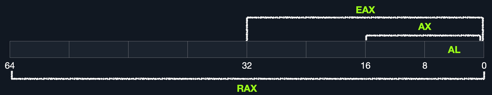

# Intro to assembly language
## Language

**assembler**: add rax, 1 == **shellcode**: 4883C001

**shellcode** is a hex representation fo **machine code**.

## Types of assembly
* intel x86_64
* ARM
    * M1
    * Mobile

[Von Neumann Architechture](https://en.wikipedia.org/wiki/Von_Neumann_architecture)

* Central Processing Unit
    * Control Unit
    * Arithmic/Logic Unit

* Memory
    * cache level 1-3 (fast)
    * Random Access Memory (slower)

## Cache
Located within the CPU itself, which in computer terms is lightyears closer than the RAM

* **level 1** kilobyte size fastest cache (slower than registers) per core 
* **level 2** megabytes shared between cores
* **level 3** megabytes (larger than l2), not all cpus have l3 

## RAM
Much larger than cache and much slower.

**Comparison**
| Memory Type | Cycles to Read |
| ----------- | ----------- |
| Registry | 1 |
| Cache | a few |
| RAM  | around 200 |

### Structure 

* **Stack** Last-in First-Out data can only be accessed with push and pop
* **Heap** data can be stored and read in any order. But is slower than stack
* **Data** data and .bss which respectivly is assinged variables and unassigned variables (buffers)
* **Text** Assembly instructions for the CPU to read

This segmentation is true for the entire systems RAM however each program/application is given its own VRAM so each application/program has its own stack, heap, data and text.

## I/O
The Input/Output include: keyboard, screen, long term storage units (hdd,ssd).

The processor access these devices using the **Bus Interface** which is a highway for data and addresses.

Accessing a long term storage unit is slower than accessing RAM. However unlike main memory this kind of storage isnt volatile like RAM, cache and registers. The benefit of long term storage is that RAM, cache and registers that after a reboot, the data on long term storage units persists while RAM etc. is wiped.

## CPU architecture

**RISC:**
Many simple instructions with more cycles yet cycles are faster and less power consuming

**CISC:**
Complex instruction with less and slower cycles and more power consumption

### Clock speed and cycle
Speed is denoted in Hertz today typically GHz which is to say how many ***billion*** cycles a second a processor performs. 4.3 GHz = 4.300.000.000 cycles a second. THATS A LOT!

Note that modern cpu's also have multiple cores running in paralel, so a 4 core at 4.3 GHz is effectively running 17,2 billion cycles a second.

### Instruction Cycle
An instruction Cycle is the cycle it takes for the cpu to process a single machine instruction

* **Fetch** IAR (Instruction Address Register)
* **Decode** Instructions from binary 
* **Execute** Fetch instruction operands from register/memory and process 
* **Store** new value in destination operand

***Note:*** All of the stages in the instruction cycle are carried out by the Control Unit, except when arithmetic instructions need to be executed "add, sub, ..etc", which are executed by the ALU.

Each Instruction Cycle takes multiple clock cycles to finish. The amount of clock cycles it takes varies from instruction and CPU architecture. 

**Example:**
If we were to execute the assembly instruction 
`add rax, 1`
, it would run through an instruction cycle:

Fetch the instruction from the rip register, 48 83 C0 01 (in binary).
Decode '48 83 C0 01' to know it needs to perform an add of 1 to the value at rax.
Get the current value at rax (by CU), add 1 to it (by the ALU).
Store the new value back to rax.

## Processor Specific
As touched upon previously there are two main ISA's:
**Complex Instrution Set Computer (CISC)** used in Intel and AMD CPU's 

**Reduced Instruction Set Computer (RISC)** ARM and Apple CPU's

### CISC
Increases the complexity of instructions to lower the overall amount of instruction cycles running on the CPU. 

### RISC
simple instructions which can be executed in one clock cycle. 
Supports about 200 instructions as opposed to CISC 1500'ish.

It is said that you can build a general-purpose computer which only supports one instruction.

### CISC vs RISC
| Aea | CISC | RISC |
| ----------- | ----------- | ----------- |
| Complexity | Favors complex instructions | Favors simple instructions |
| Length of instructions | Longer instructions | Shorter instructions |
| Total instructions per program | fewer instruction ie. shorter code | more instructions longer code |
| Optimization | Relies on hardware optimization (in CPU) | Relies on software optimization (In Assembly) |
| Instruction Execution Time | Variable | Fixed - one clock cycle |
| Instructions supported by cpu | about 1500 | about 200 |
| Power Consumption | High | very low |

## Registers, Addresses and Data Types
### Registers

There are two types of registers *data registers* and *pointer registers*
these are the ones I will focus on.
| Data Registers | Pointer Registers |
| ----------- | ----------- | 
| rax | rbp |
| rbx | rsp |
| rcx | rip |
| rdx | | 
| r8 | |
| r9 | |
| r10 | |

* Data Registers - are usually used for storing instructions/syscall arguments. The primary data registers are: rax, rbx, rcx, and rdx. The rdi and rsi registers also exist and are usually used for the instruction destination and source operands. Then, we have secondary data registers that can be used when all previous registers are in use, which are r8, r9, and r10.

* Pointer Registers - are used to store specific important address pointers. The main pointer registers are the Base Stack Pointer rbp, which points to the beginning of the Stack, the Current Stack Pointer rsp, which points to the current location within the Stack (top of the Stack), and the Register Instruction Pointer (rip), which holds the address of the next instruction.

### Sub-Registers
Each 64-bit register can be divided into smaller sub-registers

The use and purpose of these registers will be explored further down.

### Memory Adresses
x86_64-bit processors have (as the name suggests) 64-bit wide address range from 0x0 to 0xffffffffffffffff (16xf's). 

There are several ways to fetch adresses

remember lower is slower.

### Address Endianness
An address Endian is the order of which the bytes are stored or retrieved from memory.

### Little-Endian
Here the little or ending byte is filled/retrieved first. **right to left**

### Big-Endian
Here its the big or starting byte that is filled/retrieved first. **left to right**

**example**

`0x0011223344556677` is the address we would like to store in memory.

with **little-endian** we would first store 0x00 and then 0x11 -> 0x1100 -> 0x221100 -> 0x33221100 -> 0x4433221100 -> 0x554433221100 -> 0x66554433221100 -> 0x7766554433221100. So basically the value is stored in reverse.

if we wanna store a binary interger like 426 = 0000001 10101010 it would be stored in reverse 10101010 00000001 which could read as 43521 if not retrieved with little endian in mind. 

**little-Endian** is used with Intel/AMD x86 so I will default to this one if I don't specify something else.

### Data Types 

| Component | Length | Example | 
| ---------- | -------- | -------- |
| byte | 8 bits | 0xab | 
| word | 16 bits (2 bytes) | 0xabcd |
| double word (dword) | 32 bits - (4 bytes)| 0xabcdef12 | 
|quad word (qword) | 64 bits - 8 bytes | 0xabcdef1234567890 |

## Assembly File Structure
